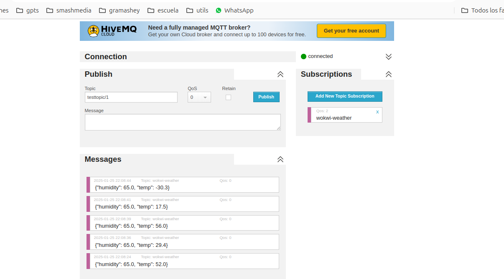
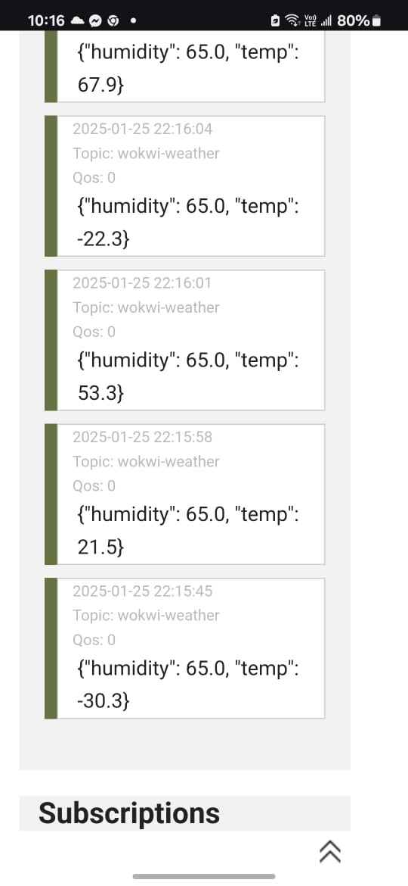
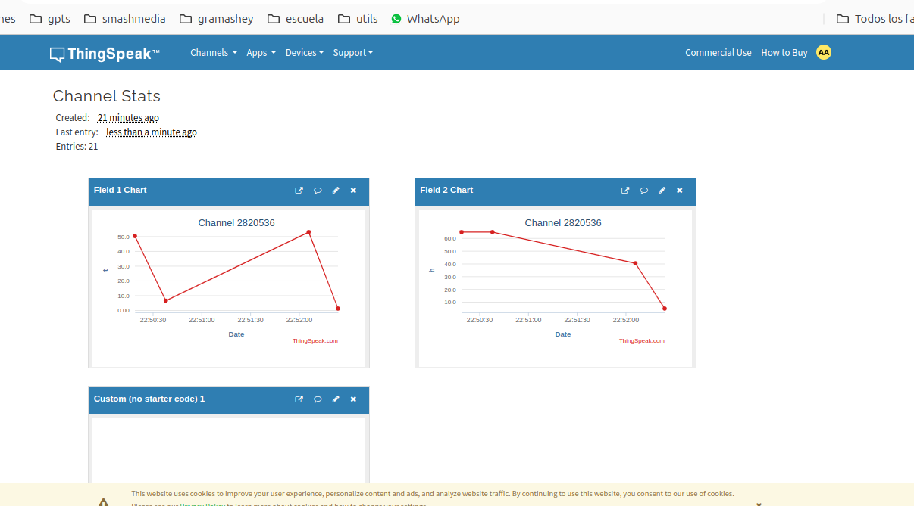

# DOCTORADO EN INGENIERÍA APLICADA

## ASIGNATURA: SEMINARIO DE PROGRAMACIÓN

### ACTIVIDAD INTEGRADORA 2: INTERNET DE LAS COSAS--


**Integrantes:** 

ISMAEL RUFINO GRAJEDA MARÍN

RUBEN CRUZ GARCIA MENDEZ

--- 

**Asesor:** DR. DANIEL GONZÁLEZ SCARPULLI

---


## Objetivo
Aplicar conceptos de Internet de las cosas para desarrollar una aplicación mediante el módulo ESP32 programado con MicroPython, visualizar los datos en un MQTT bróker y en la plataforma ThingSpeak.


## Componentes Utilizados
- Módulo ESP32
- Sensor DHT22 (Temperatura y Humedad)

## Software y Plataformas
- MicroPython
- Simulador Wokwi (https://wokwi.com/)
- MQTT Broker HiveMQ (http://www.hivemq.com/demos/websocket-client/)
- ThingSpeak (https://thingspeak.com/)


### Conexiones
- El sensor DHT22 fue conectado al pin 15 del ESP32
- Se utilizó la fuente de alimentación del protoboard para energizar el circuito

### Código
El programa implementa las siguientes funcionalidades:
- Conexión a red WiFi
- Lectura de temperatura y humedad del sensor DHT22
- Publicación de datos en el broker MQTT
- Formato JSON para el envío de datos


### Resultados de Mediciones

Registros obtenidos del sensor DHT22:

| Medición | Temperatura (°C) | Humedad (%) |
|----------|-----------------|-------------|
| 1        | 30.8           | 68.5        |
| 2        | 16.2           | 94.0        |
| 3        | -3.8           | 94.0        |
| 4        | 4.2            | 65.0        |
| 5        | 37.4           | 65.0        |

### Resultados en MQTT Broker



### Visualización en Dispositivo Móvil


## Configuración del MQTT Broker

1. Conexión al broker HiveMQ
2. Suscripción al tópico: "wokwi-clima"
3. Visualización de datos en tiempo real
4. Formato de mensajes recibidos: JSON con campos de temperatura y humedad

## Integración con ThingSpeak

### Configuración de ThingSpeak
1. Se utilizó la plataforma ThingSpeak para visualizar y almacenar los datos del sensor
2. Los datos se envían a través de solicitudes HTTP usando la API de ThingSpeak
3. Se configuraron dos campos (fields) en ThingSpeak:
   - Field 1: Temperatura
   - Field 2: Humedad

### Código de Integración
```python
def send_to_thingspeak(temp, hum):
    print("Enviando datos a ThingSpeak...")
    try:
        # Crear URL con parámetros
        url = f"{THINGSPEAK_URL}?api_key={THINGSPEAK_API_KEY}&field1={temp}&field2={hum}"
        
        # Hacer la solicitud HTTP
        response = urequests.get(url)
        if response.status_code == 200:
            print("Datos enviados correctamente!")
        else:
            print(f"Error al enviar datos: {response.status_code}")
        response.close()
    except Exception as e:
        print("Error al conectar con ThingSpeak:", e)
```

### Flujo de Datos
1. Los datos son capturados por el sensor DHT22
2. Se procesan en el ESP32
3. Se envían simultáneamente a:
   - MQTT Broker (para visualización en tiempo real)
   - ThingSpeak (para almacenamiento y análisis)

### Visualización en ThingSpeak
Los datos pueden ser visualizados en ThingSpeak de diferentes formas:
- Gráficos en tiempo real
- Histórico de mediciones
- Análisis estadístico básico

#### Gráficas de Monitoreo


En las gráficas se puede observar:
- Variación de temperatura a lo largo del tiempo
- Niveles de humedad registrados
- Correlación entre temperatura y humedad
- Tendencias en las mediciones

## Conclusiones
El sistema implementado demuestra la capacidad de:
- Recolectar datos ambientales usando el sensor DHT22
- Transmitir información a través de MQTT
- Visualizar datos en tiempo real
- Implementar un sistema IoT funcional usando componentes accesibles

## Notas Adicionales
- Los datos fueron verificados tanto en navegador web como en dispositivo móvil
- Se mantuvo una conexión estable durante las pruebas
- El sistema demostró ser capaz de manejar diferentes rangos de temperatura y humedad

## Referencias

### Bibliografía
SAP (s.f.)  comenta que la Cuarta Revolución Industrial, también conocida como Industria 4.0, lleva al futuro la automatización y la informatización que vimos en la Tercera Revolución Industrial. La Industria 4.0 está potenciada por el Internet de las Cosas Industrial (IIoT) y los sistemas ciberfísicos –sistemas inteligentes y autónomos que utilizan algoritmos basados en computadoras para monitorear y controlar cosas físicas como maquinaria, robots y vehículos–. La Industria 4.0 hace que todo en su cadena de suministro sea  "inteligente" –desde la fabricación y fábricas inteligentes hasta el almacenamiento y la logística inteligentes.
Internet de las cosas
RedHat (2019) define el Internet de las cosas (IoT) de la siguiente manera:
Es el proceso que permite conectar elementos físicos cotidianos al Internet: desde objetos domésticos comunes, como las bombillas de luz, hasta recursos para la atención de la salud, como los dispositivos médicos; también abarca prendas y accesorios personales inteligentes e incluso los sistemas de las ciudades inteligentes.